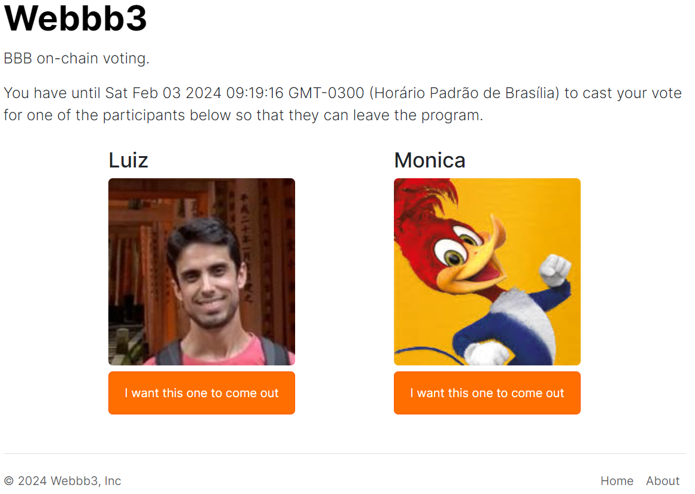

# dapp

My Webbb3 web3 frontend. Project from Web3 Week: https://www.luiztools.com.br/w3w

## How to Run

1. git clone
2. npm install
3. change contract address at services/Web3Service.js and ABI.json
4. npm run dev
5. open [http://localhost:3000](http://localhost:3000) with your browser to see the result.

    
     Initial page

    
     Voting Page

    
     Voting page completed

## Deploy on Vercel

The easiest way to deploy your Next.js app is to use the [Vercel Platform](https://vercel.com/new?utm_medium=default-template&filter=next.js&utm_source=create-next-app&utm_campaign=create-next-app-readme) from the creators of Next.js.

[My dapp ](https://webbb3.vercel.app/)